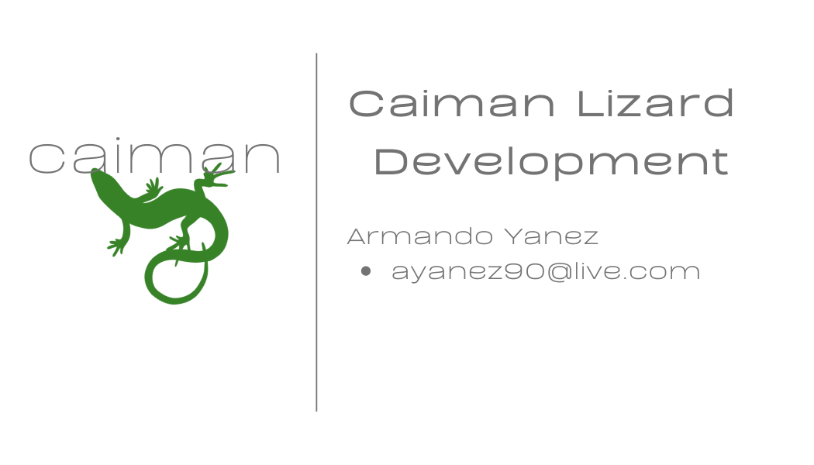

# 
**Milestone 1**

## <ins> Team Name </ins> 
### Caiman Lizard Development

## <ins> Team Motto </ins> 
### Never been easier to relax

## <ins> Team Logo </ins> 

## <ins> Team Letterhead </ins>
- #### [Team Letterhead](Letterhead.pdf)

## <ins> Team E-mail Footer </ins>

## <ins> Team Business Cards </ins>

## <ins> Resume's of Each Team Memeber </ins>
- #### [Emily West Resume](Resumes/Emily_West_Resume.pdf)
- #### [Nygel Melchor Resume](Resumes/Nygel_Melchor_Resume.pdf)
- #### [Natalie Malone Resume](Resumes/Natalie_Malone_Resume.pdf)
- #### [Armando Yanez Resume](Resumes/Armando_Yanez_Resume.pdf)

## <ins> Team Schedule </ins>
- #### [Schedule]()

## <ins> Project Ideas </ins>
- #### Idea one
- #### Idea two
- #### Idea three

### More information about initial project ideas can be found [here]().