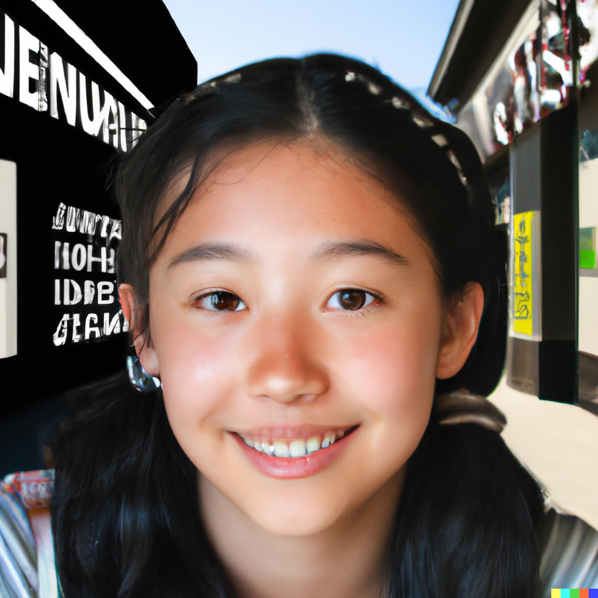
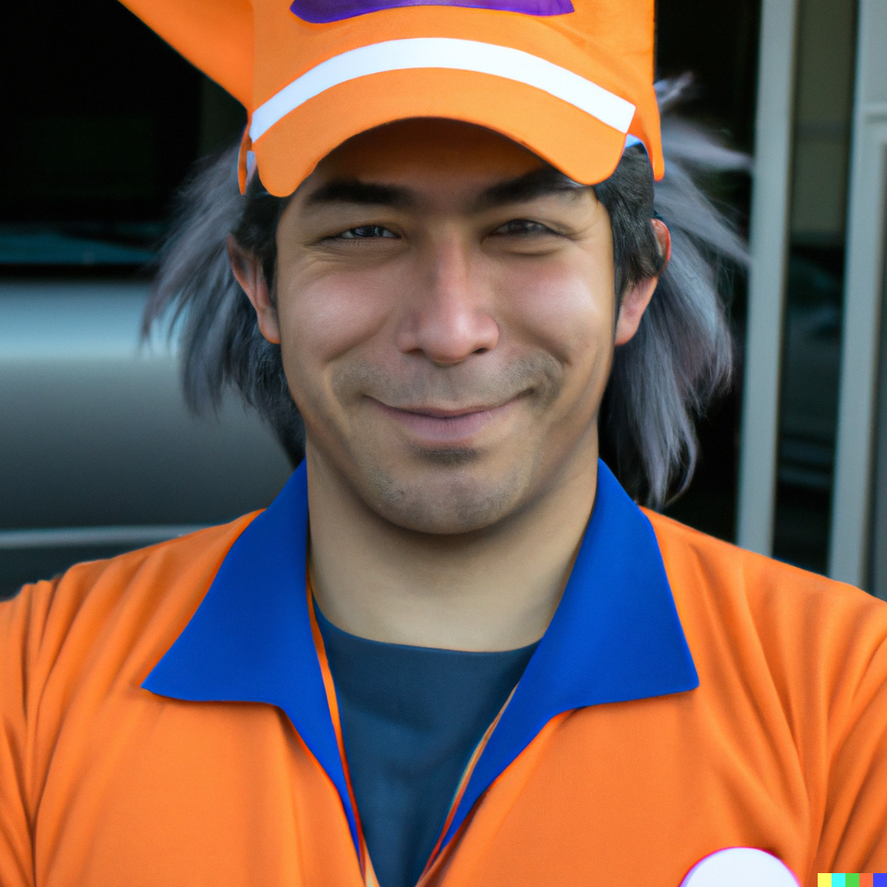
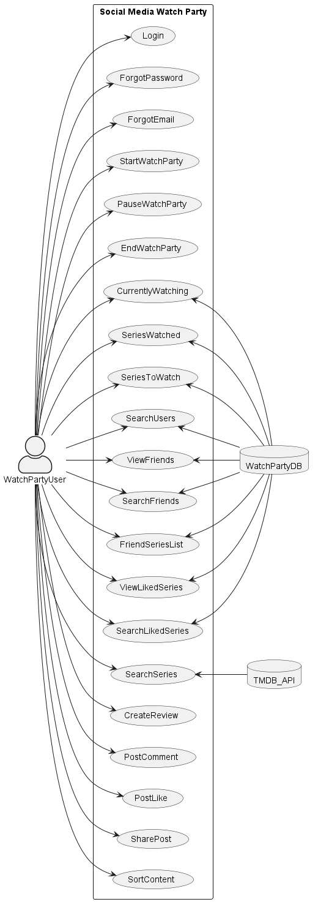
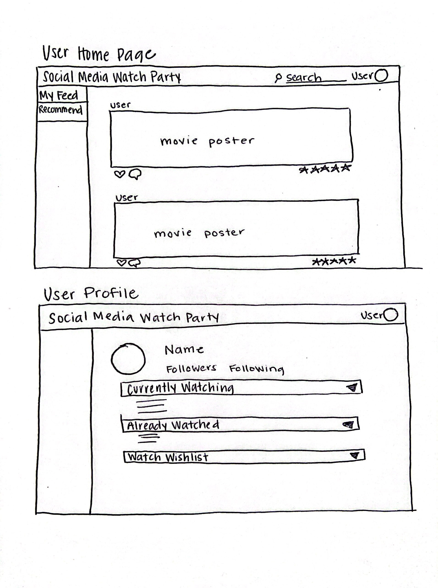
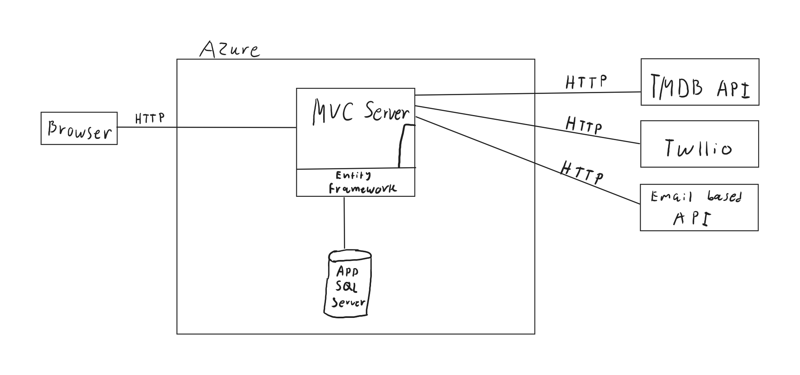

Project Inception Worksheet
=====================================

## Summary of Our Approach to Software Development
The Team Caiman Lizard Project will be following the architecture style for ASP.NET Core, along with Agile principles. Our use of scrum will mean that we will build our software in a dynamic and iterative approach. We are choosing to work in sprints that will occur every 2 weeks, while having different meetings throughout. At the end of each sprint, our software will be updated and deployed to Azure. We will achieve this by using a few communication resources including Discord and Jira, which will give us the capabilities of working in an Agile environment.

## Initial Vision Discussion with Stakeholders
Our project is for individuals who are looking for an entertaining website to connect with their friends and community over TV shows and movies. The Social Watch Party is an application that allows users to watch shows simultaneously, without having to be in the same place. It also allows users to share what they are watching, their thoughts, and ratings for shows. Users will have a profile, where they can see their past watched shows, upcoming shows, and posts created. This feature benefits the entertainment of users and their ability to find new interesting shows on all streaming platforms. Unlike other movie platforms, Social Watch Party will have a major focus on the social media aspect, making it user friendly and more interactive, allowing the user to easily access information about shows and connect with their friends online, simultaneously. 

### Description of Clients/Users
Users of our application will persist of... 
1. People who watch tv shows and movies
2. Users of streaming services
3. Users of other social media platforms
4. People who enjoy watching TV shows/movies with others

### Personas
1. 
"Grandpa Phil" is retired enginer from Seattle. He is also a proud grandfather of five grandchildren and wants to bond with them through their shared love of movies and TV series. Phil wakes up early and starts his day by reading the news and checking his email. He then spends the morning tending to his vegetable garden and doing some light exercise. After lunch, he settles in to watch movies and TV shows until dinner time. He often calls his grandchildren to discuss what they're watching and to recommend new shows. In the evening, he likes to play board games with Susan, his wife  or watch a movie together. Growing up watching classic films like Casablanca and Citizen Kane Phil now wants to share that experience with his grandchildren. He has a vast collection of DVDs and Blu-rays and has a room in his home dedicated to his hobby. Despite his age, Phil is tech-savvy and is able to navigate streaming services with ease. He is always on the lookout for new movies and TV shows that his grandchildren (William, Sophia, Ethan, Ava and Olivia) might enjoy and has started a tradition of movie nights with them every week.

2. 
"Gracie" also known as Grace, is a young girl who attends Marina Middle School located in San Francisco. She starts her day with a healthy breakfast before going to school. After school, she does her homework and practices her piano. In the evenings, she spends time watching movies and TV shows, either alone or with friends. She has a group of friends who all have different interests in terms of genre, but they always find a common ground in their shared love of movies. Her best friend, Sarah loves the TV Series "The Office" but Gracie loves to be different and says its overhyped. Gracie is a big fan of animated movies and TV series and is always eager to discover new ones. She has a vast collection of merchandise from her favorite movies and TV shows, including posters, action figures, and T-shirts. Her favorite movies showcases young robotics prodigies such as Big Hero 6 and Iron Man. Grace is known among her friends as the movie expert and is always ready to recommend her latest discoveries. She is an active member of several online movie communities and spends hours discussing movies and TV shows with like-minded fans.

3. 
"Mike" works late hours as a delivery driver in Los Angeles, and his love of anime helps keep him awake during long drives. He is an avid fan of Japanese animation and spends his free time watching and discussing his favorite shows with other fans. Mike starts his day by preparing for his delivery job, which often takes him to different parts of the city. During his breaks, he spends time watching anime on his phone, currently catching up on the latest hit season of Demon Slayer. After work, he either goes to the gym or spends time at home watching more anime. He also participates in online anime communities and forums to discuss his favorite shows and cosplay ideas. On weekends, he attends anime conventions and cosplays as his favorite character, Goku from Dragon Ball. Mike is also proud of his collection of anime figures and posters. Mike is an active member of several anime communities online and enjoys participating in online discussions and forums. He has a goal of visiting Japan someday to experience anime culture firsthand and meet other fans.

### List of Stakeholders and their Positions (if applicable)
1. Project Manager (Professor Morse) - responsible for managing the project
2. Project Team (Armando, Emily, Natalie, Nygel) - responsible for development work of the project
3. Company (Caiman Lizard Development) - organization responsible for the project and whose developers are directly involved
4. Client (Professor Morse)- the person/organization for who the project is being sold to
5. End User - people who are expected to make use of the project

## Initial Requirements Elaboration and Elicitation
###### Requirement #1 - Profile
The profile requirements goal is to have a profile page connected to each user. In this profile page there will be a friend list, liked shows and movies, and a list of their currently watching, have watched, and to be watched movies and shows. The profile will show some of the users information including, username, name, and profile picture. This is the main scope of the profile requirements. The limitations to this requirement is the login authentication and account creation. This will need to be manually entered for testing or created before the profile can accurately display information. We will need a database to store profile information. 

###### Requirement #2 - Main Page
The main page requirement will be the main content feed for the application. This page will show posts from friends, recommendations of shows, and a search bar to look for shows and movies in the database. The user will be able to like, comment, and reshare any public post. The user can also create posts on the main page, where they can write a review or rate a certain show. The recommendations of shows will come from friend posts or suggestions of popular shows from the database. The mind map shows the connections between items on the main page. The database of movies and shows will use the TMDB API. This requirement relys on the ability to create posts and profiles. 

###### Requirement #3 - Database Search
The database search requirement is located on the home page. From there a user is able to search for any movie, tv show, platform, or user. The movie and tv show database will be provided through the TMBD API, the user database will be created. Once the user has searched a query, there will be a list of results. The user can then choose a result and perform an action including, go to a profile, make a rating or review, add movie or show to a list, or see movies and shows from a provider. This search will be dependant on the capabilities of a search algorithm as well as our database. The search will also rely on when we create profiles for users.

###### Requirement #4 - Watch Party
The watch party requirement is where users are able to watch a show or movie with their friend, in an online setting at the same time. The functionality for this will be provided through the use of an API or chrome extension, which has yet to be decided. The user will be able to chat with their friends while watching a shared screen. Users will be able to invite their friends to their watch party through a link or invite request through the application. This requirementis still a work in progress.

### Elicitation Questions
1. 
2. 
3. ...

### Elicitation Interviews
Transcript or summary of what was learned

### Other Elicitation Activities?
As needed

## List of Needs and Features
1. Recommendations for what shows/movies to watch
2. Stay updated on latest shows/movies
3. See what your friends are watching and recommending
4. Watch shows/movies with friends at the same time in a different place
5. Lists of watched, currently watching, and watch next movies and shows
 6. Reviewing and rating what you watch
 7. Up to date database of TV shows and movies

## Initial Modeling

### Use Case Diagrams

### Sequence Diagrams

### Other Modeling

## Identify Non-Functional Requirements
1. Dependencies:
    1. Visual Studio Community 2022 v.17.4.4
    2. Dotnet 7
    3. SQL Server 2022
2. Website should load pages within 1 second, not including information attained from APIs
3. Secure login and information storage, following best practices
4. Compatability for windows, mac, and ios
5. The system must perform without failure in 95 percent of use cases during a sprint
6. User-friendly; users are able to learn the application in 5 minutes, users are satisfied with the design
7. Follows all legal requirements for an application

## Identify Functional Requirements (In User Story Format)

E: Epic  
U: User Story  
T: Task  

7. [E] 
    1. [U]
        a. [T]
        b. [T]
    2. [U]
        a. [T]

## Initial Architecture Envisioning

## Agile Data Modeling
Diagrams, SQL modeling (dbdiagram.io), UML diagrams

## Timeline and Release Plan
Milestones have occured during the inception phase of this group project, occurring every Monday since January 16th. The
first sprint will take place on Monday, February 20th. Sprints will have a duration of 14 days and will repeat until Western
Oregon University's Academic Excellence Showcase (AES). Initially, releases will be fixed - with a transition to Continuous
Integration and Continuous Deployment (CI/CD).